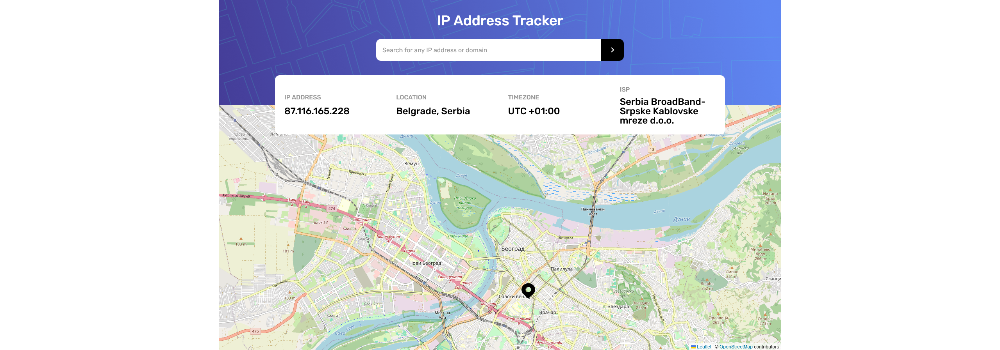

<h2>IP address tracker</h2>

- Solution URL: [Solution](https://github.com/DejanSheki/ip-address-tracker-master)
- Live Site URL: [Live Preview](https://ip-address-tracker.vercel.app/)

## Technologies Used

- React
- Vite
- CSS (Tailwind CSS)
- [IPAPI](https://ipapi.co/)
- [React Leaflet](https://react-leaflet.js.org/)

# Frontend Mentor - IP address tracker solution

This is a solution to the [IP address tracker challenge on Frontend Mentor](https://www.frontendmentor.io/challenges/ip-address-tracker-I8-0yYAH0). Frontend Mentor challenges help you improve your coding skills by building realistic projects.

### The challenge

Users should be able to:

- View the optimal layout for each page depending on their device's screen size
- See hover states for all interactive elements on the page
- See their own IP address on the map on the initial page load
- Search for any IP addresses or domains and see the key information and location

## Author

- Website - [Dejan Lukic](https://www.dejanlukic.com)
- Frontend Mentor - [@DejanSheki](https://www.frontendmentor.io/profile/DejanSheki)
- Twitter - [@DejanSheki](https://twitter.com/DejanSheki)
- CSSBattle - [@dejansheki](https://cssbattle.dev/player/dejansheki)
